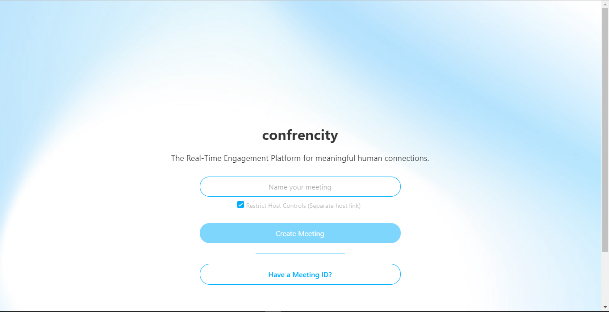
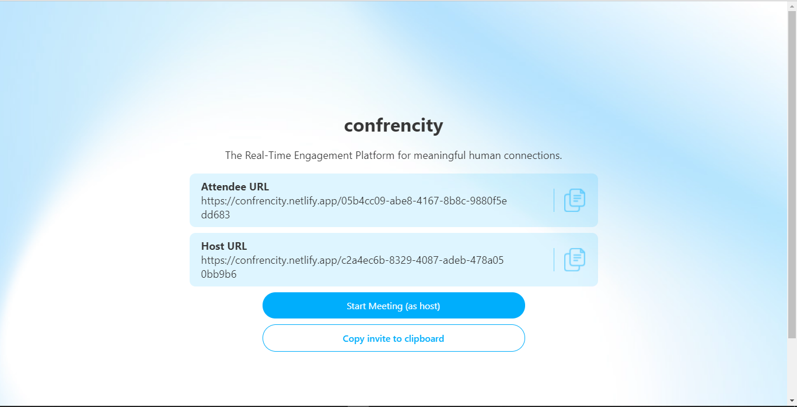
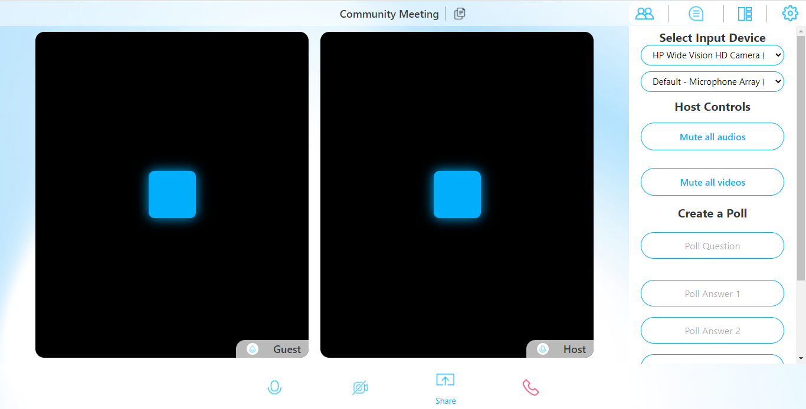
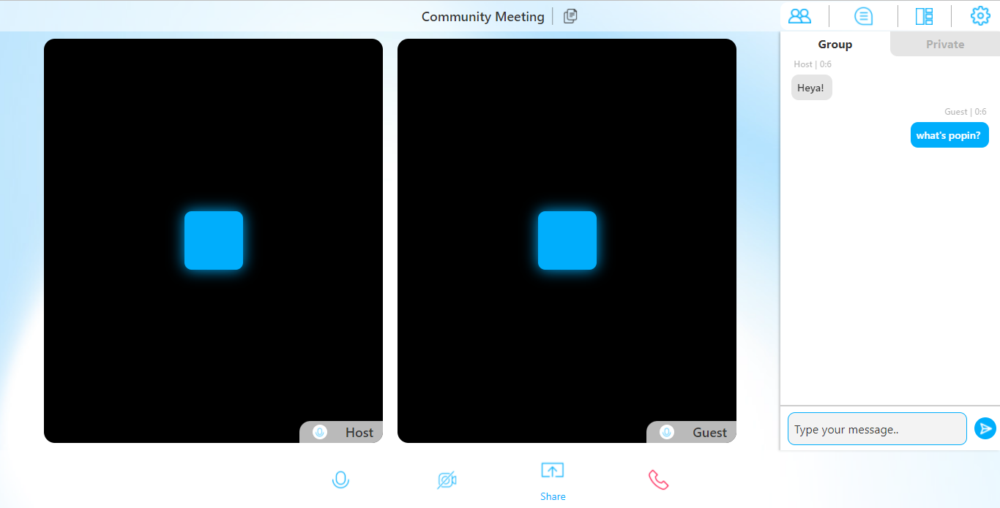
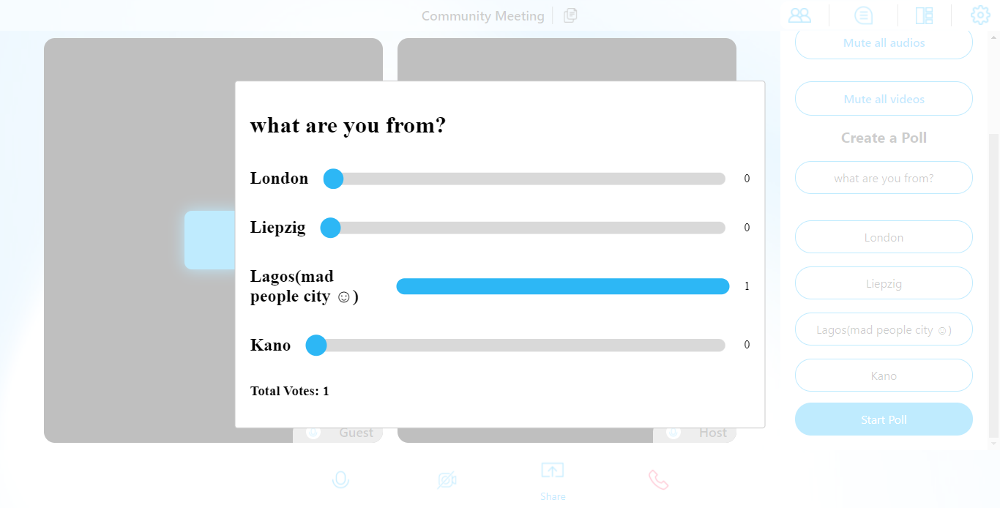

# Confrencity

This is a video confrencing platform bootstraped with [Agora BuildKit](https://appbuilder.agora.io/) and written in React and Typescript.

The [Agora Buildkit](https://appbuilder.agora.io/) allows you to write code for multiple platforms such as the web, mobile & desktop.

Although, I built this app just for the web.

**Features** built include:

- Video Calling including:
  - muting audio
  - muting video
- Messaging
- Polls(Voting)

<h3>Screenshots:</h3>

<h3>Homepage</h3>

<h3>Meeting Creation</h3>

<h3>Video Calling</h3>

<h3>Messaging</h3>

<h3>Voting</h3>

Hosted on [Netlify](https://confrencity.netlify.apps)
